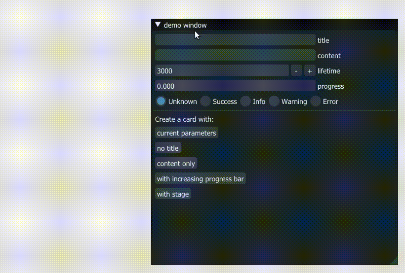

# ImGui info-center

[](https://github.com/yc-feej/imgui-info-center/actions/workflows/cpp-ci.yaml) [](https://github.com/yc-feej/imgui-info-center/blob/main/LICENSE)

## Introduction

An integrated notification and information center created with dear ImGui.

Interfaces and variables are designed under the maximum standard of C++ 14. Following google coding style. 

We **do** use STL libraries and C++ defined data structures.

We **don't** use static variables.

## Core features

Most features shown below could be used individually. For example, `ImInfoCenter` provided management and parameter forwarding of `ImInfoCard`, but info card itself could be used and managed directly by users.

### Info Card  -- `ImInfoCard`

Provides small suspending information card when something worth notifying happens. User can define title, content, progress bar, buttons and maybe some other stuffs on their own, as well as lifetime of each card. It behaves intuitively with interactions.



### Info Center -- `ImInfoCenter`

A singleton allowing users to add, delete or manage info cards, mainpulate notification window and style control. 

### Notification Window -- `ImNotice`

**WIP**

## Usage

You might familiar with ImGuiIO - using info center is as simple, although it might not be the same as ImGui itself, since we are trying to avoid using **non-POD static variables in our library code**. A typical example is shown below.

```
auto& info_center = ImInfo::ImInfoCenter::Get();

// Some behavior that will be called once when triggered
// We use a button here
if (ImGui::Button("Add a new info card")) {
  info_center.AddCardBasic("This is title", "This is content", 3000 /* This is lifetime */);
}

// We record index of the card here so that to do something later.
static int32_t index = 0;
if (ImGui::Button("Add a new info card with progress")) {
  index = info_center.AddCardProgressBar(10.0f /* This is initial progress */, "New title", "New content", 3000); // All parameters optional
}

// In our main loop
info_center.Show();

// Add some progress!
info_center.IncreaseCardProgress(index, 0.5f);

```

## Build example

The example here is using opengl (glfw + glew). We build the example with bazel, and that's the only thing you need to install by yourself to run the example (yes, you don't even need ImGui).

### 1.Install bazel

Please follow [this tutorial](https://docs.bazel.build/versions/main/install-ubuntu.html#install-on-ubuntu) to install bazel. We suggest to use bazel version > 4.0.0.

### 2. Build and run

```
cd imgui-info-center
source run.sh
run_example
```

## About this projects

I'm rather a C++ developer than an ImGui developer, so it's not providing C style interfaces, my apologies.

Some works are inspired by imgui-notify.

Pull requests and issue discussions are welcome. Please contact me at `yuchen9507@gmail.com` if you have any other concerns. Thanks!
